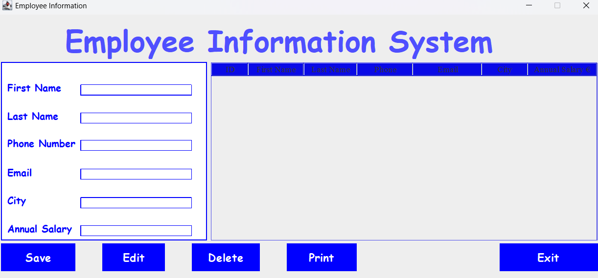
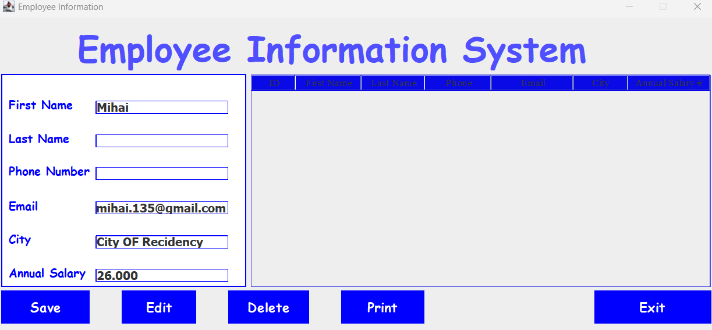
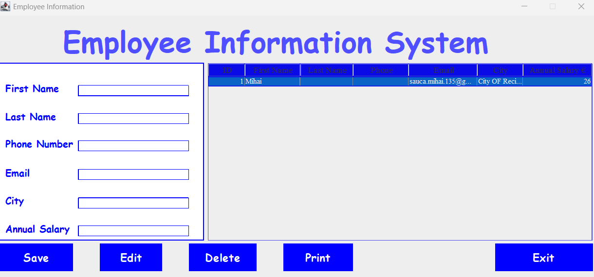

# EmployeeInfo 🚀

*Manage employee data with ease using a sleek Java Swing CRUD application powered by SQLite!*

**EmployeeManager** is a desktop application built with Java Swing and SQLite, designed to manage employee data efficiently. It features a user-friendly split-pane interface where you can input employee details in a form on the left and view real-time database updates in a table on the right. Perform Create, Read, Update, and Delete (CRUD) operations with dedicated buttons, all while ensuring intuitive and seamless interaction.

## 📸 Screenshots

| **Form and Table View** |
|----------------|
| |
| **Inserting Values** |
|  | 
| **Changes are Reflected in DB View** |
| |
| *The split-pane GUI with form and table* | 

## ✨ Features

- **Split-Pane Interface**: 
  - Left side: Form to input/edit employee details (e.g., Name, Phone, Email, Salary).
  - Right side: Real-time table displaying all employee records from the SQLite database.
- **CRUD Operations**:
  - **Insert**: Add new employee data via the form.
  - **Edit**: Update selected employee data (select a row, edit form, and click Edit).
  - **Delete**: Remove selected employee records.
  - **Print**: Output employee data (e.g., to console or file).
  - **Exit**: Close the application gracefully.
- **Real-Time Updates**: The table reflects changes instantly after any CRUD operation.
- **Row Selection**: Must select a table row to perform Edit or Delete operations.
- **SQLite Database**: Stores data locally in a file within the project folder (`employeeDB.db`).
- **User-Friendly Design**: Simple, intuitive interface built with Java Swing.

## 🛠️ Technologies Used

- **Java**: Core programming language with Swing for the GUI.
- **SQLite**: Lightweight, file-based database for storing employee data.
- **JDBC**: For database connectivity and operations.

## 📋 Prerequisites

To run EmployeeManager, ensure you have:
- Java Development Kit (JDK) 8 or higher installed.
- SQLite JDBC driver (included in the project or via Maven).
- A Java IDE (e.g., IntelliJ IDEA, Eclipse) or command-line tools for compilation.
- Git (optional, for cloning the repository).

## 🚀 Getting Started

### 1. Clone the Repository
```bash
git clone https://github.com/your-username/EmployeeManager.git
cd EmployeeManager
```

## 2. Set Up the Database
- The SQLite database file (employees.db) is created automatically in the project folder upon first run.
- No external database server is required, as SQLite uses a local file.

## 3. Install Dependencies 
If using Maven, ensure the pom.xml includes the SQLite JDBC driver:
```bash
<dependency>
    <groupId>org.xerial</groupId>
    <artifactId>sqlite-jdbc</artifactId>
    <version>3.42.0</version>
</dependency>
```
- Run mvn install to download dependencies.
- If not using Maven, include the SQLite JDBC driver JAR in your project’s classpath.

## 4. Compile and Run
- Using an IDE: Import the project, build, and run the Main class.
- Using Command Line:
```bash
javac -cp .:lib/sqlite-jdbc-3.42.0.jar src/*.java
java -cp .:lib/sqlite-jdbc-3.42.0.jar Main
```
Note: Replace lib/sqlite-jdbc-3.42.0.jar with the actual path to your SQLite JDBC driver.

## 5. Use the Application
- **Insert**: Fill the form on the left and click "Insert" to add a new employee.
- **Edit**: Select a row in the table, update the form fields, and click "Edit".
- **Delete**: Select a row and click "Delete" to remove it.
- **Print**: Click "Print" to output employee data (e.g., to console).
- **Exit**: Click "Exit" to close the application.

## ❓ How It Works
- 1 **Form Input**: Enter employee details (e.g., Name, ID, Email, Salary) in the left panel.
- 2 **Table View**: The right panel displays all employees in a table, updated in real-time.
- 3 **Action Buttons**: Below the split pane, five buttons control all operations:
  - **Insert**: Adds form data to the database.
  - **Edit**: Updates the selected row with form data.
  - **Delete**: Removes the selected row.
  - **Print**: Outputs employee data.
  - **Exit**: Closes the app.

- 4 **Row Selection**: For Edit or Delete, select a row in the table first. If no row is selected, a warning dialog appears.

## 📂 Project Structure
```bash
EmployeeManager/
├── src/
│   ├── Main.java              # Entry point for the application
│   ├── Employee.java          # Employee model class
│   ├── DatabaseHandler.java   # SQLite database operations
│   ├── EmployeeGUI.java       # Swing GUI implementation
├── tests/
│   ├── EmployeeDatabaseTest.java              # Test Class for the database
├── Referenced Libraries/
│   ├── sqlite-jdbc-3.42.0.jar # SQLite JDBC driver
├── employees.db               # SQLite database file (generated on first run)
├── pom.xml                   # Maven configuration (optional)
├── README.md                 # This file
├── images/                   # Folder for screenshots
```

## 🔧 Usage Notes
- **Row Selection Required**: For Edit or Delete, you must select a row in the table, or a dialog will prompt you to select one.
- **Real-Time Updates**: The table refreshes automatically after every Insert, Edit, or Delete operation.
- **Database Location**: The employees.db file is stored in the project root. Ensure write permissions in the directory.
- **Error Handling**: The application includes basic error handling for database operations and invalid inputs.

## 🐞 Troubleshooting
- **Database Connection Issues**: Ensure the SQLite JDBC driver is referenced in the classpath and the project folder is writable.
- **No Rows Selected**: If you click Edit or Delete without selecting a row, a dialog will remind you to select one.
- **Dependencies Missing**: If using Maven, run mvn clean install. Otherwise, download the SQLite JDBC driver manually.

## 🌟 Contributing
Contributions are welcome! 
1. Fork the repository.
2. Create a new branch (git checkout -b feature/your-feature).
3. Commit your changes (git commit -m "Add your feature").
4. Push to the branch (git push origin feature/your-feature).
5. Open a Pull Request.

Please ensure your code follows the project’s coding style and includes appropriate tests.

## 📜 License
This project is licensed under the MIT License. See the LICENSE file for details.

## 👐 Acknowledgments
- <a href="https://www.sqlite.org/">**SQLite**</a> for the lightweight database.
- <a href="https://docs.oracle.com/javase/8/docs/technotes/guides/swing/">**Java**</a> Swing for the GUI framework.
- <a href="https://github.com/xerial/sqlite-jdbc">**SQLite JDBC Driver**</a> for database connectivity.

Built with 💻 and ☕ by Mihay135. Star ⭐ this repo if you find it useful!


